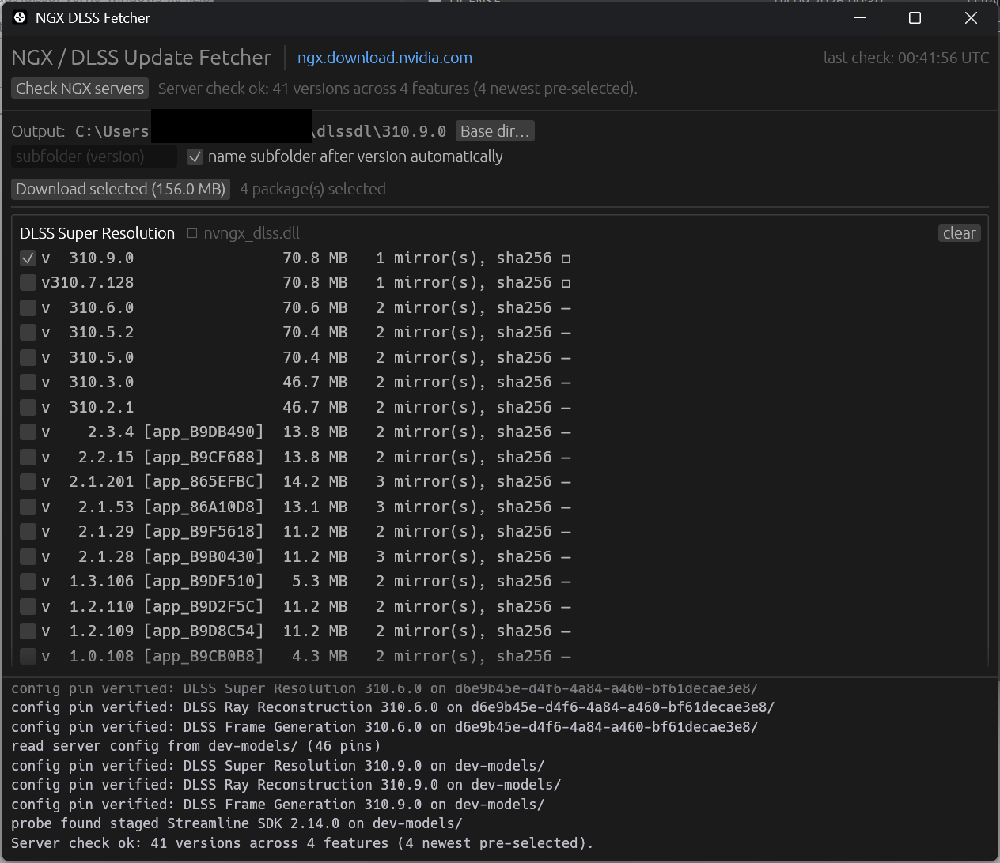

# dlssdl — NGX DLSS Update Fetcher

A small Rust / egui (wgpu **D3D12** renderer) tool that checks NVIDIA's NGX OTA
update servers for the latest **DLSS Super Resolution**, **DLSS Ray
Reconstruction**, **DLSS Frame Generation** and **Streamline SDK** packages,
lists all offered versions and downloads the selected ones into a single
subfolder named after the version number — with the files renamed to their
proper consumer names (`nvngx_dlss.dll`, `nvngx_dlssd.dll`, `nvngx_dlssg.dll`,
`sl.common.dll`, …).



## How it works

NVIDIA's NGX updater (`nvidia-ngx-updater` / `NGXUpdater.exe`) fetches feature
updates from `https://ngx.download.nvidia.com`, which is a **publicly listable
S3 bucket** (`ngx-ota-nvidia-com`). Objects follow the layout:

```
<namespace>/org/nvidia/team/ngx/models/<feature>/versions/<version-id>/files/<payload>
```

| Server feature | Payload on server          | Consumer file name    |
|----------------|----------------------------|-----------------------|
| `dlss`         | `160_E658700.bin`          | `nvngx_dlss.dll`      |
| `dlssd`        | `160_E658700.bin`          | `nvngx_dlssd.dll`     |
| `dlssg`        | `160_E658700.bin`          | `nvngx_dlssg.dll`     |
| `sl_sdk_0`     | `160_E658703.zip`          | `sl.common.dll`, `sl.deepdvc.dll`, `sl.dlss.dll`, `sl.dlss_d.dll`, `sl.dlss_g.dll`, `sl.nis.dll`, `sl.nvperf.dll`, `sl.pcl.dll`, `sl.reflex.dll` |

Notes discovered while building this tool:

* The `.bin` payloads are **plain PE files** (the DLL itself, just renamed).
  Verified byte-size-identical with the DLLs inside the `dlss_override` zips.
* `<version-id>` packs as `major << 16 | minor << 8 | patch`
  (e.g. `20317442` → `310.5.2`, `133888` → `2.11.0`, `20318080` → `310.7.128`).
  Verified against `nvngx_package_config.txt` shipped in the packages and the
  PE version resources.
* The bucket currently hosts two namespace copies (`d6e9b45e-…` and
  `3e933c08-…`); the tool lists both and prefers mirrors that publish a
  `<payload>.sha256` sidecar (raw lowercase hex) for integrity verification.
* Payload names are `<arch-prefix>_<app-id>.bin|.zip`. `160` is the
  NV_GPU_ARCHITECTURE_ID of Turing; NVIDIA ships that file for every GPU
  generation, but the parser accepts *any* hex prefix/app-id so new arch or
  app-specific builds are still listed (tagged `[1B0]` / `[app_…]` in the UI).
  Legacy per-game DLSS 2.x snippets of the same version are collapsed into a
  single row, preferring the canonical `E658700`/`E658703` payload.
* **Listing limitations & deep discovery**: the listing endpoint caps at
  1000 keys and strips `continuation-token`/`prefix`/`start-after`, so a plain
  listing cannot see everything (the newest namespace `dev-models` — NVIDIA's
  staging channel — is cut off). The tool therefore
    1. parses each namespace's `nvngx_server_config.txt`, which pins the
       current feature versions (e.g. `[dlss] app_E658700 = 310.9.0`), and
       HEAD-verifies those objects, and
    2. HEAD-probes the next plausible packed version ids (minor+1..+3, build
       0/128) for staged-but-unlisted builds.
* **Freshness**: as of September 2026 the tool finds **DLSS 310.9.0**
  (SR/RR/FG, uploaded 2026-09-02, with sha256 sidecars) and **Streamline
  2.14.0** staged on the `dev-models` channel — newer than anything on the
  production namespaces (310.7.128 / 2.12.128) and not yet offered by the
  NVIDIA App. The production namespaces top out at 310.7.128 / 2.12.128.
  NVIDIA's per-namespace `nvngx_server_config.txt` may pin different versions
  per channel; this tool lists whatever is actually hosted on each channel.

## Integrity / build flavor

The downloaded files are the production artifacts NVIDIA's own updater deploys
(consumer channel), *not* the `dev` flavor from the developer SDK:

* every file carries an embedded NVIDIA Corporation Authenticode signature
  (`signtool verify /pa` → *Successfully verified*, sha256 + RFC3161
  timestamp) — the same check anti-cheats perform;
* downloads are verified against NVIDIA's own `sha256` sidecars where the
  server publishes them, so the bytes are exactly what NVIDIA hosts;
* the SDK `dev` builds are never distributed via OTA: for DLSS FG 310.6.0 the
  dev binary is 13,940,336 bytes vs 7,499,376 for the rel/OTA class — the OTA
  files match the rel size class;
* NGX's diagnostic hooks (logging etc.) are dormant in all consumer DLLs and
  only activate via environment variables / registry keys — identical to every
  DLL shipped with games.

## Usage

```
cargo run --release
```

1. Click **Check NGX servers** — the tool lists every offered version per
   feature (newest pre-selected).
2. Pick the versions you want. The subfolder name is filled in automatically
   with the selected DLSS version (uncheck *auto* to type your own).
3. Click **Download selected**. Files land in
   `<Downloads>/<version>/` (e.g. `Downloads\310.7.128\nvngx_dlssg.dll`).

Non-GUI helpers (same code paths):

```
cargo run --example ngx_dump               # print the server offering
cargo run --example ngx_fetch -- dlssg     # download one feature headlessly
cargo run --example ngx_fetch -- sl 2.11.0
cargo test                                 # version decoding / key parsing tests
```

## Implementation

* `src/ngx.rs` — S3 bucket listing (paginated `list-type=2`), key parsing,
  version decoding, streaming downloads with SHA-256 verification and
  rename/zip-extraction to consumer names (`ureq` + `roxmltree` + `zip` + `sha2`).
* `src/gui.rs` — egui UI (top status bar, per-feature version groups with
  checkboxes, progress bar, color-coded log, "open output folder").
* `src/main.rs` — eframe bootstrap forcing `wgpu::Backends::DX12`
  (`eframe::egui_wgpu::WgpuSetup::CreateNew` with DX12 `InstanceDescriptor`).

No NVIDIA SDK or credentials are involved; everything comes from the same
public endpoints the driver's NGX Updater uses.

## Privacy / network

The tool talks to exactly one host: `https://ngx.download.nvidia.com` (public
S3 bucket listing + public object downloads). No telemetry, no accounts, no
tokens, nothing is uploaded — it only reads.

## Platform & building

Windows 10/11 with any RTX GPU. Build from source with a stable Rust
toolchain:

```
cargo build --release
```

The renderer is forced to wgpu's D3D12 backend; no other GPU vendor is
supported (that is inherent to DLSS).

## License

MIT — see [LICENSE](LICENSE). DLSS, Reflex and Streamline are trademarks of
NVIDIA Corporation; this is an unofficial community tool.

Disclaimer: community tool, not affiliated with NVIDIA. Swapping DLSS/Streamline
DLLs into game folders is at your own discretion.
